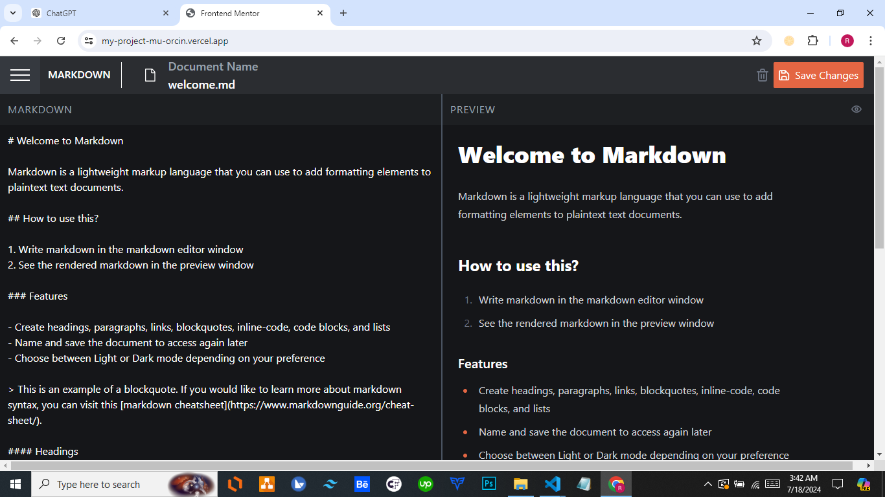

# Amalitech Project - In-browser markdown editor solution

This is a solution to the [In-browser markdown editor challenge on Amalitech Project](https://www.frontendmentor.io/challenges/inbrowser-markdown-editor-r16TrrQX9). Frontend Mentor challenges help you improve your coding skills by building realistic projects.

## Table of contents

- [Overview](#overview)
  - [The challenge](#the-challenge)
  - [Screenshot](#screenshot)
  - [Links](#links)
- [My process](#my-process)
  - [Built with](#built-with)
  - [What I learned](#what-i-learned)
- [Author](#author)

## Overview

### The challenge

Users should be able to:

- Create, Read, Update, and Delete markdown documents
- Name and save documents to be accessed as needed
- Edit the markdown of a document and see the formatted preview of the content
- View a full-page preview of the formatted content
- View the optimal layout for the app depending on their device's screen size
- See hover states for all interactive elements on the page
- **Bonus**: If you're building a purely front-end project, use localStorage to save the current state in the browser that persists when the browser is refreshed
- **Bonus**: Build this project as a full-stack application

### Screenshot

### Links

- Solution URL: [GitHub Repository](https://github.com/BentumYaw001/my-project.git)
- Live Site URL: [Live Demo](https://my-project-mu-orcin.vercel.app/)

## My process

### Built with

- Semantic HTML5 markup
- CSS custom properties
- Flexbox
- CSS Grid
- Mobile-first workflow
- [React](https://reactjs.org/) - JS library
- [Next.js](https://nextjs.org/) - React framework
- [Styled Components](https://styled-components.com/) - For styles

### What I learned

During this project, I strengthened my skills in JavaScript, Tailwind CSS, React.js, CSS, and HTML. Here are some code snippets that highlight what I learned:

## Author

- Website - [Bentum Yaw Richmond](https://personal-portfolio-five-ivory.vercel.app/)

---
